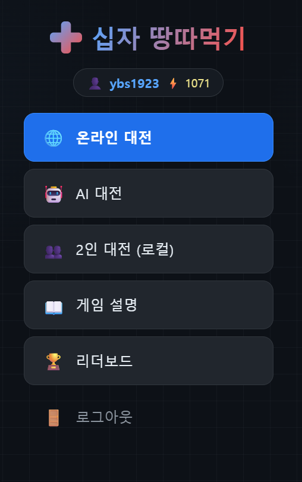
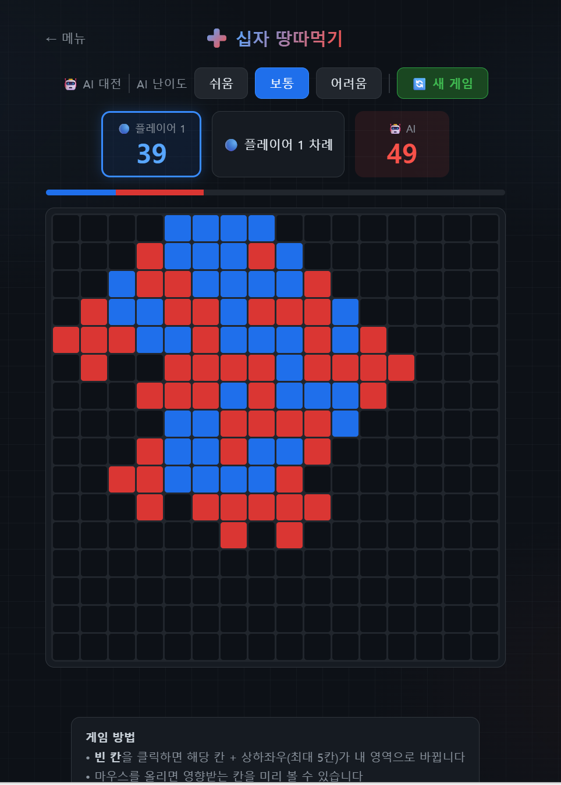

# ✚ 십자 땅따먹기

실시간 온라인 멀티플레이어 영역 점령 게임

🔗 **[플레이하기 → gridcrossgame.onrender.com](https://gridcrossgame.onrender.com)**

---

## 게임 소개

12×12 보드에서 두 플레이어가 번갈아 칸을 점령하며 영역을 넓히는 전략 게임입니다.  
빈 칸을 클릭하면 해당 칸과 상·하·좌·우 인접 칸(최대 5칸)이 내 영역이 됩니다.  
상대방 칸도 범위 안에 있으면 빼앗을 수 있습니다.  
상대방 칸 덩어리를 완전히 둘러싸면(벽 3면 이상 접촉 시 제외) 통째로 뒤집는 포위 포획도 가능합니다.

모든 칸이 채워졌을 때 더 많은 영역을 차지한 플레이어가 승리합니다.

---

## 주요 기능

- **온라인 대전** — 랜덤 매치메이킹 또는 유저 이름으로 직접 초대
- **AI 대전** — 쉬움 / 보통 / 어려움 / 전문가 (alpha-beta 가지치기 minimax)
- **2인 로컬 대전** — 같은 화면에서 두 명이 플레이
- **레이팅 시스템** — ELO 방식, 온라인 대전에서만 변동 (기본 1000점)
- **턴 타이머** — 수당 20초 제한, 초과 시 자동 패배
- **기권** — 게임 도중 언제든 기권 가능
- **리더보드** — 온라인 레이팅 순위표
- **효과음** — Web Audio API 기반 인터랙티브 사운드
- **계정 시스템** — 처음 입력하면 자동 계정 생성, 이후 로그인

---

## 기술 스택

| 분류 | 기술 |
|------|------|
| Frontend | Vanilla HTML / CSS / JavaScript |
| Backend | Node.js + Express |
| 실시간 통신 | WebSocket (ws) |
| 데이터베이스 | MongoDB Atlas |
| 배포 | Render |

---

## 로컬 실행 방법

```bash
# 1. 저장소 클론
git clone https://github.com/YeomBoSeong/GridCross.git
cd GridCross

# 2. 의존성 설치
npm install

# 3. 환경변수 설정 (.env 파일 생성)
echo MONGODB_URI=your_mongodb_connection_string > .env

# 4. 서버 실행
node server.js
```

브라우저에서 `http://localhost:3000` 접속

> MongoDB URI 없이 실행하면 서버는 뜨지만 계정/레이팅 저장이 되지 않습니다.

---

## 프로젝트 구조

```
GridCross/
├── server.js                  # Node.js 백엔드 (Express + WebSocket)
├── territory_game_online.html # 메인 게임 클라이언트
└── package.json
```

---

## 스크린샷

| 메인 메뉴 | AI 대전 |
|-----------|---------|
|  |  |

---

## 라이선스

MIT
